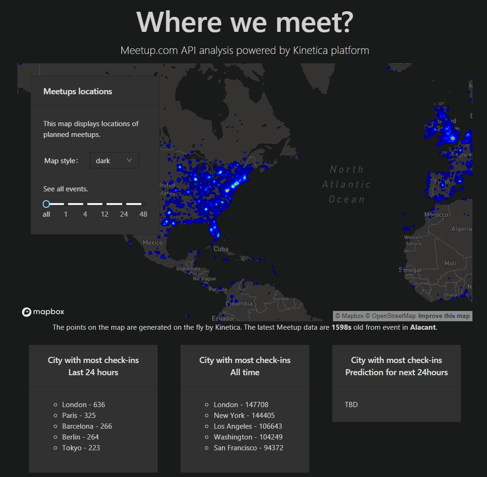

## Meetup.com analysis using Kinetica platform

This project is written in JavaScript and React. It utilizies Kinetica [Kickbox.js](https://github.com/kineticadb/kinetica-kickbox-mapbox-gl) libarary
which is a client-side code-acellerator library aimed at getting you up and running with Kinetica and Mapbox GL as quickly as possible.

Mapbox is open source mapping platform for custom designed map. Their SDK makes
it super easy to get feature rich map into your app.

## Project description

The project is set-up using the standard `create-react-app` command.

#### Used libraries:
The main libraries are:
- Kickbox.js ( For easy integration of Kinetica WMS API )
- Mapbox ( Used by kickbox to deliver nice bakground maps )
- Kinetica JS API libaray ( to utilize other Kinetca features )

Other noticable libraries:
- React
- Antd ( Component library for React )
- Less ( For compiling the less into CSS )

#### File structure

All the files are commented, you should be able to determine everything from them.

The main map component (Kickbox.js integration) is configured in the file [MainMap.js](/src/components/MainMap.js),
there is also implemented the filtering of the map.

You can see usages of standard Kinetca JS API in the file [CitiesInfo.js](/src/components/CitiesInfo.js)

## Development

### Configure
You have to setup ip to your Kinetca DB instance in the [config.js](src/config.js)

### `yarn install`
Will install all neccessasry librarries.

### `yarn start`

Runs the app in the development mode. 
Open [http://localhost:3000](http://localhost:3000) to view it in the browser.

The page will reload if you make edits. 
You will also see any lint errors in the console.

#### `yarn run build:less`

For changing CSS use `build:less` or run `lessc --js App.less App.css`.
Recommend (when run `build:less`): run `lessc --js --less-plugin-clean-css App.less App.css` to have compressed css

## Production build

### `yarn run build`

`yarn run build:less` & `yarn run build:react`

Builds the app for production to the `build` folder. 
It correctly bundles React in production mode and optimizes the build for the best performance.

The build is minified and the filenames include the hashes. 
Your app is ready to be deployed!

